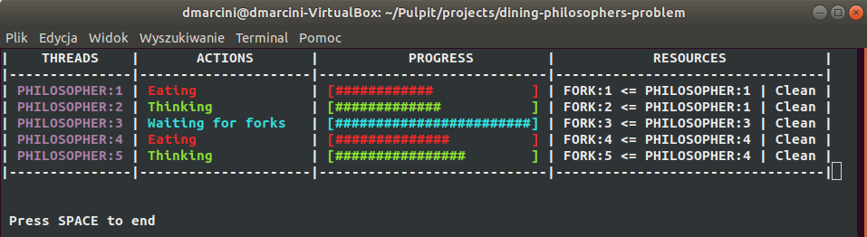

# Dining philosophers problem

Multi-threaded console application that implements the dining philosophers
problem using the Chandy-Mistra solution. This solution allows for a large
degree of concurency, and can solve an arbitrarily large problem.
Threads and resources status is visualized in the terminal.

#### Steps of the algorithm
1. For every pair of philosophers contending for a resource,
   create a fork and give it to the philosopher with the
   lower ID (n for agent Pn). Each fork can either be dirty
   or clean. Initially, all forks are dirty.
2. When a philosopher wants to use a set of resources (i.e. eat),
   said philosopher must obtain the forks from their contending neighbors.
   For all such forks the philosopher does not have,
   they send a request message.
3. When a philosopher with a fork receives a request message,
   they keep the fork if it is clean, but give it up when it is dirty.
   If the philosopher sends the fork over, they clean the fork before doing so.
4. After a philosopher is done eating, all their forks become dirty.
   If another philosopher had previously requested one of the forks,
   the philosopher that has just finished eating cleans the fork and sends it.

source: https://en.wikipedia.org/wiki/Dining_philosophers_problem

---

## Screenshot


---

## Technology
* C++11
* ncurses library

---

## Requirements
* Linux system
* C++11 compiler
* ncurses library installed (package: libncurses5-dev)
* cmake installed (package: cmake)

---

## Building & Running
```
mkdir build
cd build
cmake ..
make
cd ../bin

./dining-philosophers-problem [number-of-philosophers]
```
